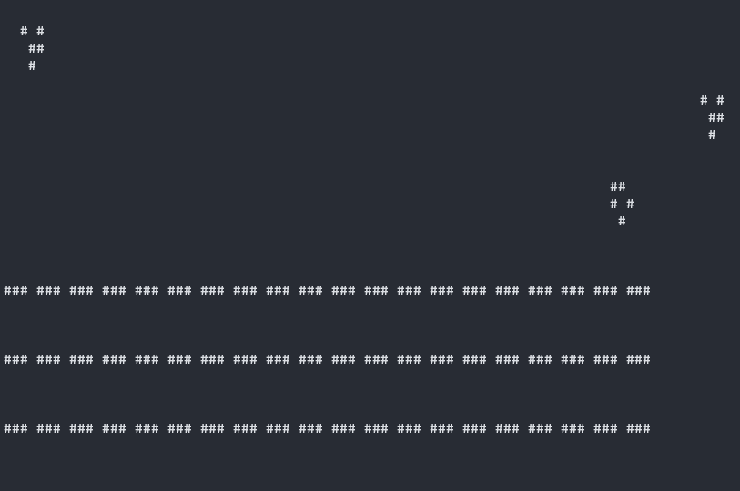

# Game of life
> This game was created for the purpose of completing the Object oriented programming course.

[](https://forthebadge.com)

<!--  -->


## Technologies

- [C++](https://isocpp.org/) (standard 11) - C++ language

## Usage & development setup
> Prerequisites: get yourself a C++ compiler e.g. G++.
1. Clone/pull repository.
2. In source folder run compiler
```sh
$ g++ main.cpp Engine.cpp Matrix.cpp PrinterTXT.cpp -o main.exe
```

3. Run the program

```sh
$ main.exe
```

## Try your ideas
You can change the starter board by editing the template.txt file

## License

All code is released under the [MIT](./LICENSE) License.